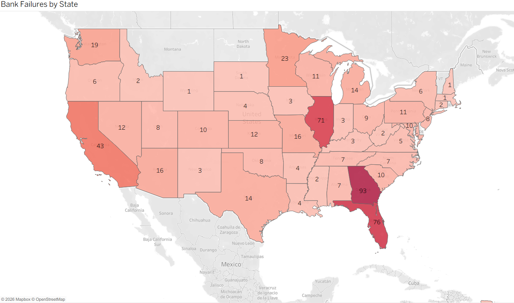
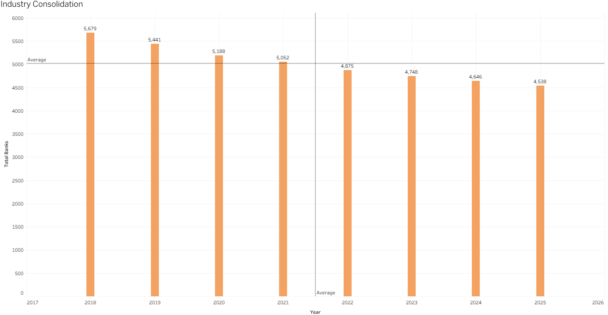

# FDIC-U.S.-Banking-Health-Risk-Analysis
Python data pipeline and Tableau dashboard looking at the health and risk of the U.S. banking industry from 2018-2025 With ROA trends, capital ratios, uninsured deposit exposure, bank failures by state and industry consolidation by FDIC Call Report data.

# Key Findings

There are three stories in this chart. The Capital Ratio (orange) declined from 30.40 in 2018 to a low of 15.83 in 2022, then partially recovered to 18.63 by 2025. The post-2008 regulatory buffers were eroded as interest rates increased and asset values changed. The red line shows the Uninsured Deposit percentage steadily rising from 21.24 to a peak of 27.41 in 2022 before falling slightly, the exact risk profile that made SVB and Signature Bank vulnerable to bank runs. The ROA line (in teal) was flat between 1.2 and 1.5 for the entire period, indicating that systemic risk was building, but surface-level profitability metrics gave little warning of the stress below.

Most bank failures were focused in the Southeast and Midwest, led by Georgia with 93 failures, followed by Florida and Illinois with 76 and 71 failures respectively. These three states alone account for a disproportionate share of total failures, a reflection of the regional exposure to real estate lending that collapsed during and after the 2008 financial crisis. Rounding out the top five are California with 43 and Minnesota with 23. Institutional risk was driven primarily by geographic concentration in high-growth real estate markets, with few failures in the Mountain West and Great Plains states.

The US banking industry underwent a period of substantial consolidation between 2018 and 2025, during which the number of FDIC-insured banks declined from 5,679 to 4,538, representing a decline of over 1,100 institutions over a span of seven years. The pace of consolidation was consistent year over year, never reversing, signaling that mergers, acquisitions and failures are systematically changing the competitive landscape. If the current rate continues, the industry could have fewer than 4,000 active banks over the next decade, but the average of about 5,020 banks disguises the clear downward structural trend.

## Main Takeaway
The U.S. banking industry from 2018 to 2025 is a story of quiet structural degradation masked by stable profitability. The return on assets was relatively flat over the period but the underlying risk indicators were moving in the wrong direction. The capital ratios were almost halved, the exposure to uninsured deposits was at a level that killed banks like SVB and Signature Bank, and the total number of banks fell by more than 1,100 in just seven years. The 2023 regional banking crisis was not a surprise but the expected outcome of trends that were visible in the data going back to 2020.
Looking ahead to 2026 and 2027, the data shows the industry is at an inflection point. Capital ratios are rebounding from 2022 lows, and percentages of uninsured deposits pulled back slightly after the SVB collapse prompted both regulatory scrutiny and changes in depositor behavior. But consolidation shows no signs of reversing. If the rate of bank closures and mergers seen between 2022 and 2025 continues, the industry could fall below 4,200 institutions by the end of 2027. The smaller community banks are under the most pressure, as higher compliance costs, the need to invest in technology, and margin compression from larger competitors make independence increasingly difficult to sustain. The next wave of consolidation, likely to be driven not by crisis but by strategic necessity, will see regional mid-size banks become prime acquisition targets for larger institutions looking to expand deposit bases and geographic footprint ahead of an anticipated rate normalization cycle.

## Tools Used
Python: Loaded and merged 32 raw CSV files from the FDIC Call Report database containing 8 years’ worth of quarterly banking data between 2018 and 2025.

Pandas: All data cleaning and transformation. Standardize column names across quarterly files. Transformed financial metrics to numeric types. Created new fields including Loan to Deposit Ratio, Uninsured Deposit Percentage, and Equity to Assets. Summarized data into annual, state-level, and bank size summaries for Tableau.

Tableau Public: Created three interactive dashboards analyzing the health of the U.S. banking industry, including a multiline trend chart tracking capital ratios, ROA, and uninsured deposit exposure over time; a filled map showing bank failures by state; and a bar chart illustrating the steady decline in total FDIC-insured institutions from 5,679 in 2018 to 4,538 in 2025.

GitHub: For version control and public hosting of the project repository, including the Python cleaning script, links to raw data, and README documentation for portfolio presentation.

## Dashboard
[Banking Health and Risk Analysis](https://public.tableau.com/app/profile/raianul.quader/viz/FDICU_S_BankingHealthRiskAnalysis/Dashboard1)

## Data Source
Data sourced from the [FDIC BankFind Suite Bulk Data Download](https://banks.data.fdic.gov/bankfind-suite/bulkData/bulkDataDownload) and the [FDIC Bank Failures List](fdic.gov/bank-failures/download-data.csv). Call Report data and bank failure records were used in accordance with the FDIC public data usage policy.
